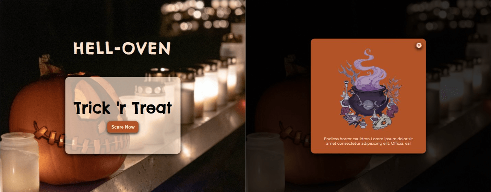

# JS Modal

JS Modal is a small Vanilla JS project to get better at JavaScript DOM manipulation. This is the first time I used Parcel Bundler.

## Tech Stack

- HTML, SCSS, JavaScript, Parcel

## Lessons Learned

- Used Postcss Autoprefixer but it didn't work, still looking for an answer on the net.
- After building dist folder, type:"module" attribute breaks the script file so I had to remove it.

## Project JS Goals

- On hover to button card remove title and show bg image of monsters
- Select scare now button
- Add event listener to button
- On click button, display modal
- Select close modal button
- Add event listener to button
- On click button, close modal

## Live

You can check the project here. [▶ JS Modal Live](https://helloween-modal.netlify.app).
